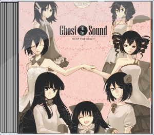

<iframe width="100%" height="450" scrolling="no" frameborder="no" src="https://w.soundcloud.com/player/?url=https%3A//api.soundcloud.com/playlists/340413632&amp;color=ff9900&amp;auto_play=false&amp;hide_related=false&amp;show_comments=true&amp;show_user=true&amp;show_reposts=false"></iframe>

### A Day
kaerucarさん作詞作曲 
「[奏でる日常の音色](http://nanachi.sakura.ne.jp/kanade.html)」をイメージした曲

### Activate
kaerucarさん作詞作曲 
「[カッシーニの空隙](http://blankrune.sakura.ne.jp/ghost/ghost_info.html)」をイメージして制作された曲

### Feather
kaerucarさん作詞作曲 
「[鉄の夢](http://nonamefactory.shillest.net/)」をイメージした曲

### サテライト
amoさん作詞 
あやちぎん作曲 
「[ウチュウステーション.](http://712.shillest.net/)」をイメージした曲

### Dear Milady
ゆりさん作詞 
あやちぎん作曲 
「[Yours sincerely](http://usada.sakuratan.com/)」をイメージした曲

### Tomorrow
kaerucarさん作曲 
「[Bar Lakritze](http://dormitory315.web.fc2.com/)」をイメージした曲

### リップルマークときみの足跡
作詞：鹿毛成士 
作曲：そわこ 
編曲：kaerucar 
[TheseThreeWords](http://from-a-distance.sakura.ne.jp/) をイメージした曲

### パンのうた
編曲：緑音 
作詞：あやちぎん 
作曲：あやちぎん 
[幻日幻月環](http://earlduant.blog.fc2.com/)をイメージした曲

## GHOST IN THE SOUND
2010年に「何かキャラソンプロジェクト」という企画で制作したアルバムです 
 

<a class="btn btn-primary" href="/music/GHOST IN THE SOUND.zip" role="button" data-tracking="Music,Download,GhostInTheSound">ダウンロード(zip 約42MB)</a>
